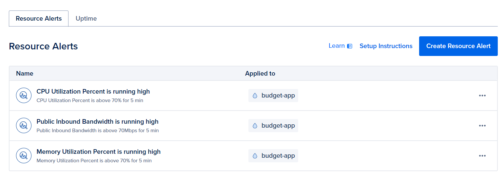
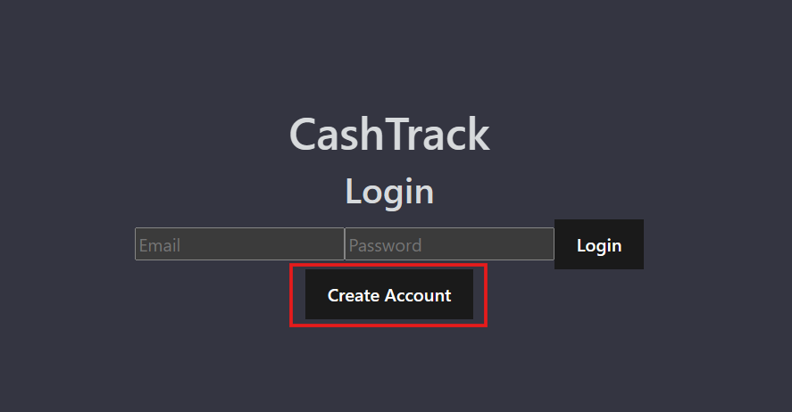
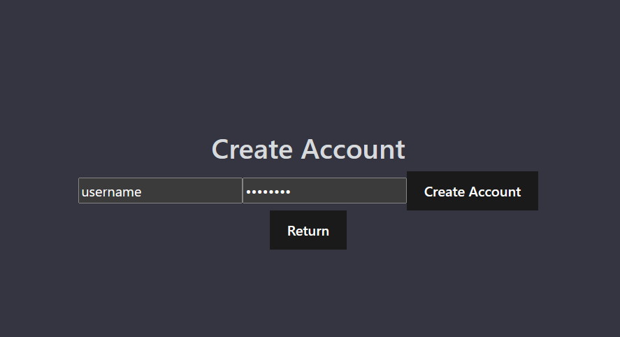
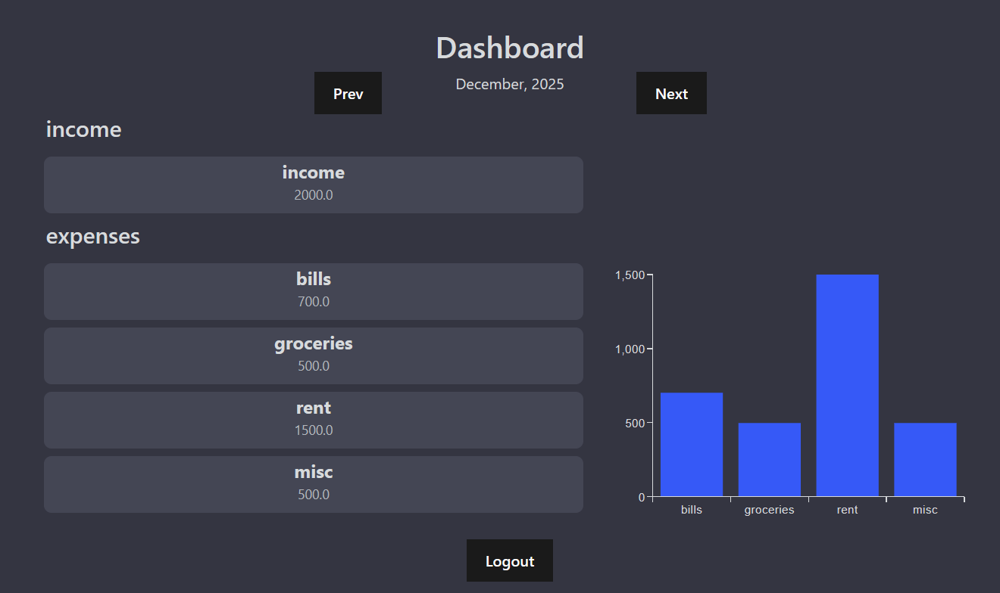
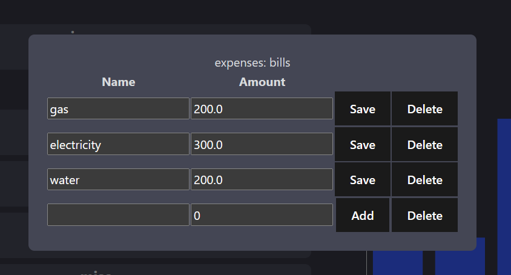

# Team Information: 

Tian Yu, 1005363848, tianm.yu@mail.utoronto.ca

# Motivation: 
Money is the main stressor for 42% of Canadians in 2025, up from 38% in 2021 according to FP Canada. These numbers seem accurate especially given the context of the cost-of-living crisis. This stress often comes from uncertainty around bills and expenses, and therefore, a major way to alleviate the problem is proper budgeting. However we can struggle to find time to do so, especially with the growing complexity of technology and our quickly shifting world. Therefore, our group has been motivated to make a streamlined and accessible budging application to help reduce financial stress.

# Objectives
The first objective is to setup all the required features of a basic budgeting application. This includes user account creation and management, as well as the ability to upload, view, and edit budgets. We also want to implement some graphical tools to help with visualization. Finally we want to add some security features like HTTPS and json web tokens to secure user data.

The second objective is to implement the required technical features for deployment and production. This includes a github ci/cd pipeline to make deployment easy, monitoring tools in our final digital ocean environment, and a docker-swarm orchestration setup to allow to scale to multiple worker nodes and deal with increased user volume. 

# Technical Stack
The backend is implemented using a python flask WSGI framework, hosted on a Gunicorn HTTP server, and postgres db. This server hosts all endpoints, as well as a statically compiled frontend UI. The frontend is based on ReactJS and Vite. 

Deployment and orchestration is performed using docker swarm. The deployment consists of two docker images, one being the python server with static built frontend resources, and the second as a prebuilt postgres image. The postgres image utilizes a persistent volume, and the server image can be scaled to multiple replicas to deal with increased user traffic.

# Features
Programming languages: Python and Javascript

## Basic Feature: User account management
A basic feature of our application is user account creation and usage. From the homepage, you can create and account or login. When an account is created, details are stored in a persistent postgres database, and when you login, details are validated against this database. This helps satisfy the state management requirement of the project.

## Basic Feature: User budget viewing and editing
Another basic feature of the application is the ability for a user to view and edit parts of their budget once they login to their account. Once authenticated, users can input different budget elements, as well as view their previously entered entries and monthly summaries, as well as see a graphical overview. Data can be independently stored and retrieved for multiple users without overlap. This also helps satisfy the state management requirement of the project.

## Basic Feature: Monitoring and Observability
A development and deployment feature we implemented was monitoring via digitalOcean's tools. We deployed our docker swarm orchestrated project onto a digitalOcean droplet, which allowed us to integrate monitoring services. We installed the digital ocean metrics agent to provide metrics on the dashboard, and created several resource alerts on the monitoring page:

## Advanced feature: security
Security is important to our project as we want user data to be protected from potential attacks, especially as financial adjacent data is being uploaded. There are three aspects to our security implementation

1.  HTTPS implementation: generated cert and key files are required in our budget-backend/creds directory. these are used by the Gunicorn server to enable HTTPS connections, security encrypting web traffic.

2. Json Web Tokens for session authentication: JWTs are provided after initial login. these tokens contain the encrypted user id, as well as a token expiration time, and are required for any backend requests for user data. Their encryption prevents token spoofing to access other users data. They are set to HTTPonly which prevents JS attacks to steal user tokens, and encoded with an expiry time, which makes it harder to use stolen tokens.

3. Hashed password storage: All user passwords are hashed and salted before storage in postgres. This prevents any persistent storage of plaintext passwords, prevents reconstruction of passwords from stored strings, and adds some protection against attacks like rainbow tables.

## Advanced feature: CI/CD
We implemented a github workflow as a CI/CD pipeline. The manifest for the workflow  is present in .github/workflows. This pipeline does the following:

1. Upon every merge to the main branch, build the docker image from the Dockerfile

2. Push the dockerfile image to our remote docker hub repository at tianmyu/budget-app:latest

Since our docker compose file uses this image, it allows for easy updating of any docker compose or docker swarm based deployments after each merge to main.

# User Guide:
## Making an account and logging in
Click on create account, and on the following page enter a username and password

 

Once your account is created, you should immediately be redirected to the dashboard. From this point you can edit items as follows:

## Adding and editing budget items

from the dashboard, you can see your expenses for the current month, and switch between months using the "prev" and "next" buttons at the top of the page.

To see details or edit items, you can click on one of the cards to bring up the details page. From this page, you can edit, add, or remove any expenses.

When you're completed, you can click on the "Logout" button, which clears the jwt token from your browser and logs you out.

# Development Guide:
To run the deployment locally, the steps are simple, and as follows, once you have cloned the github repository:

1. Setup HTTPS: generate a cert.pem and key.pem file. Then make folder in the repository "creds/" and insert your credentials. This can be a self-signed certificate using openSSL, or obtained from a provider.\
If you want to disable HTTPS, remove the "--certfile=creds/cert.pem", "--keyfile=creds/key.pem" arguments from the Dockerfile

2. create a .env file in the home directory with the following fields:\
    DB_USER=\
    DB_PASSWORD=\
    DB_NAME=\
    DB_PORT=\
    JWT_KEY=\
We recommend generating a secure JWT key, which will be used to encrypt all JWT tokens

3. Using docker compose: run "docker compose up --build" to build and run the app. 

4. (Optional) Using docker swarm: generate a completed compose file by first running "python gen_compose.py" > compose.p.yml, which will fill the fields in compose.yml using the .env arguments.\
compose.p.yml can then be used directly by docker swarm
"docker stack deploy -c docker-compose.yml 'stack-name'"

The database will automatically be initialized and stored as a persistent docker volume, and accessible at localhost:DB_PORT. The database can be reset by deleting the volume at "stack name"_db-data 

# Deployment Information:
live url: 64.225.4.9:8000

# Individual Contributions: 
All contributions by Tian Yu

# Lessons Learned and Concluding Remarks: 
We learned the importance of properly setting up development and deployment pipelines during the development process. While setting up a dockerfile and a proper docker compose takes some effort in the initial stages of project development, it greatly increases the ease of later stage work. Dockerfiles allow for deployment and development without the concerns of setting up identical environments each time. Using docker compose makes communication between multiple containers very easy, in our case, between our server and postgres server. It allows allows for a relatively easy translation to docker swarm in the production deployment phase. Finally, using docker makes final cloud deployment easy as well, as instead of needing to transfer all files between development and deployment environments, we can use docker hub for hosting the docker image and deploy by transferring only our docker compose file. 

Overall the project experience has been insightful in showing first hand the entire development to deployment pipeline for a near production ready application.